<h3>Personal Home Lab Setup</h3>

  
<h2>Infrastructure</h2>

- Raspberry Pi 5 (home server)
    - WireGuard VPN (Remote Connection)
    - Terminus app for iPhone ssh
    - UFW Firewall 
    - LAMP Stack (Apache, MariaDb, and PHP8.2)
    - Claude API Integration (Really good to pair with tmux for across-device sessions)
    - Wake on LAN (To remotely start my Windows PC from shutdown state)

<h2>VPN Setup</h2>
  
<h1>Download WireGuard and Port Forwarding</h1>

I am not going to post screenshots of my admin page for my home network. But just sign on and allow connections coming from WireGuard under the Port Forwarding section

<strong>It is important to use Google or AI (Claude for me) to help with steps not shown here </strong>
 

<h1>Install piVPN</h1>

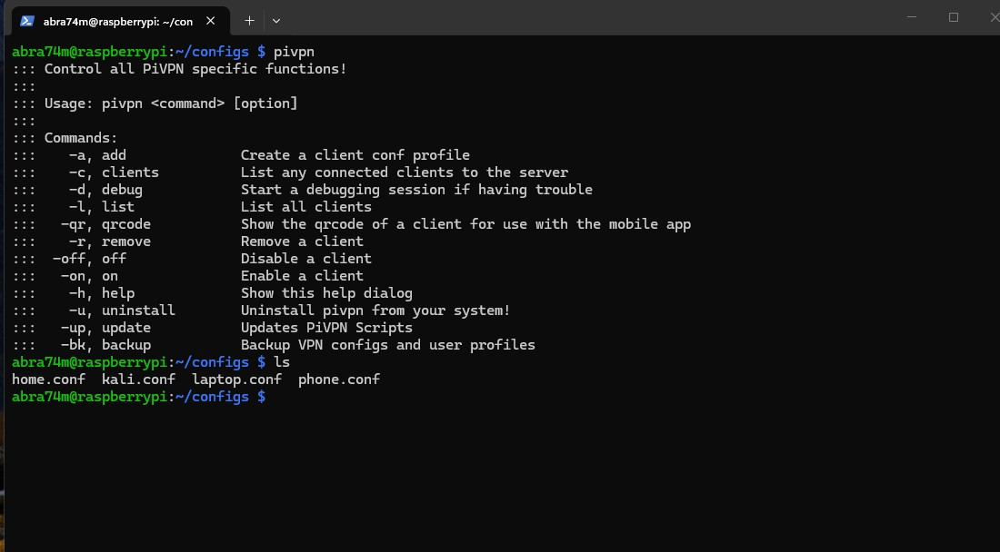

You can add clients and use the generated configuration file on the WireGuard VPN App. You can even generate a QR code to connect phones easier.

 
<h1>Generated Config</h1> 

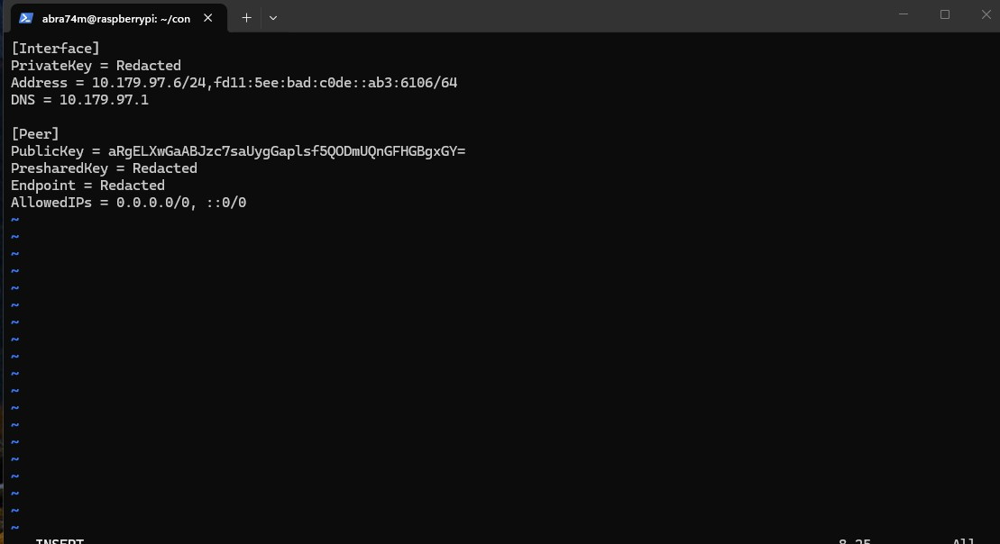
 
<h1>Windows Client Setup</h1>

Just add a tunnel and select the generated config file

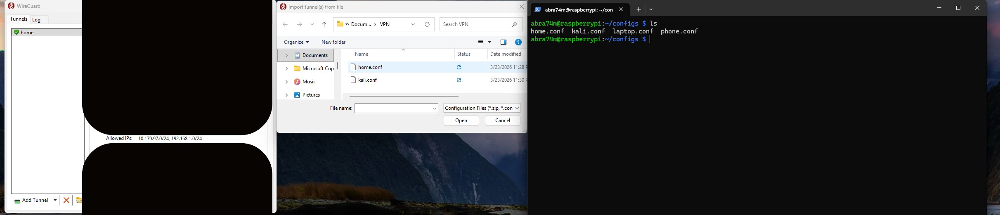
 
<h1>iPhone Client Setup</h1>

Use the -qr flag to generate a QR code for the specified client

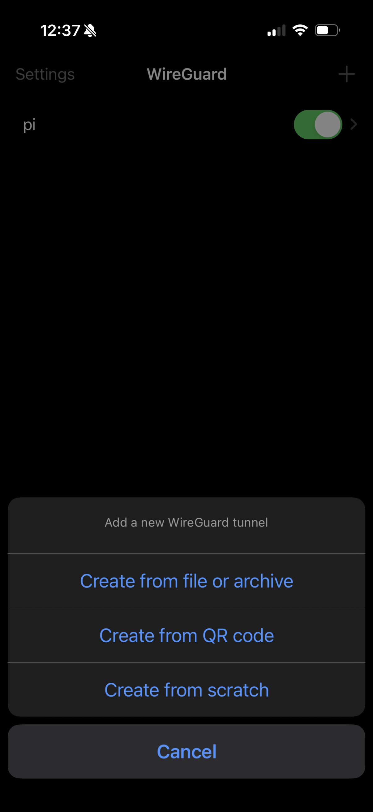
 

<h2>SSH access</h2>

SSH access works across all devices that are setup with the VPN service. I had to specify on my Windows PC to allow ssh incomming connections tho to jump from Pi to PC from my Phone. I also had to change vpn settings for Windows client which was shown in the Windows WireGuard VPN img

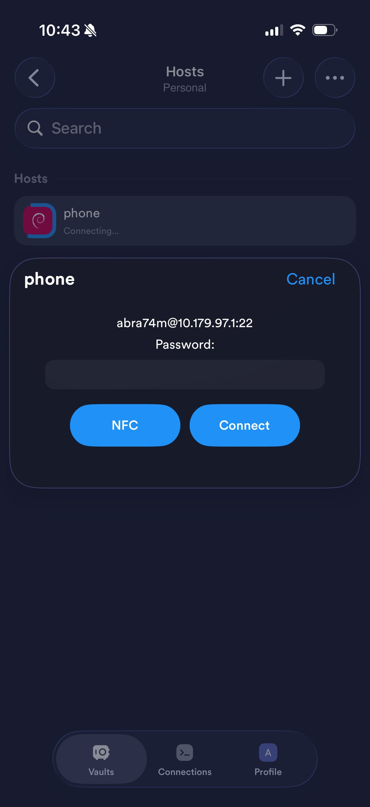

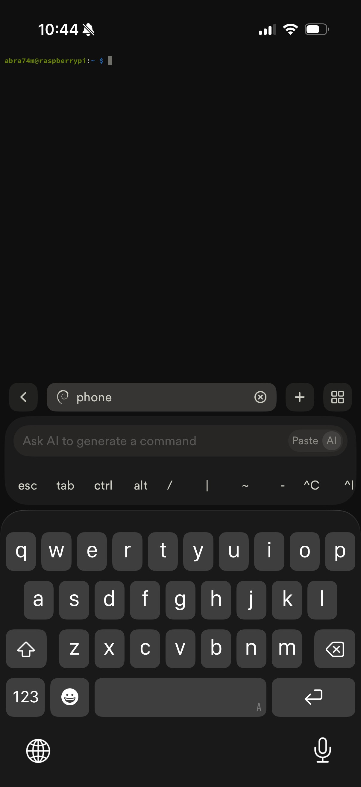
 
<h1>UFW</h1>

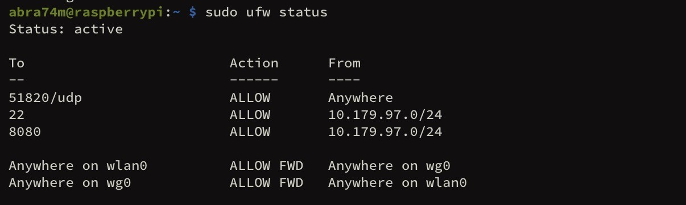
 
<h1>Apache</h1>

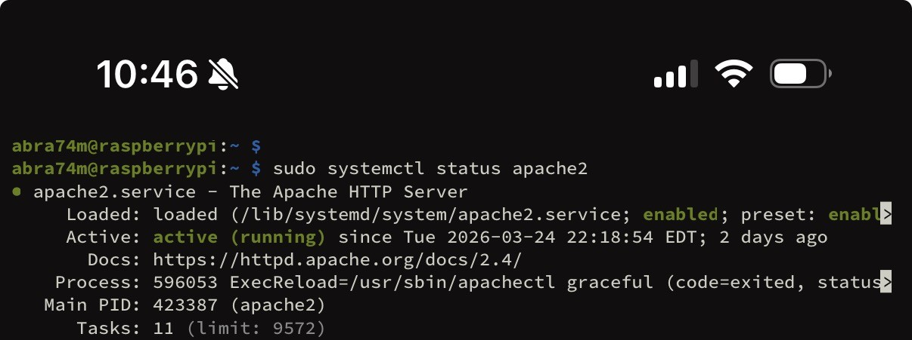
 
<h1>MariaDB</h1>

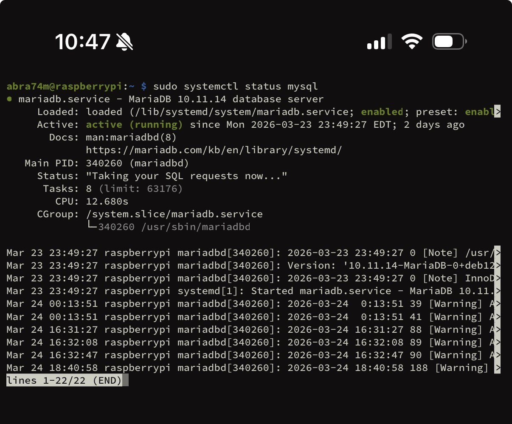
 
<h1>PHP</h1>

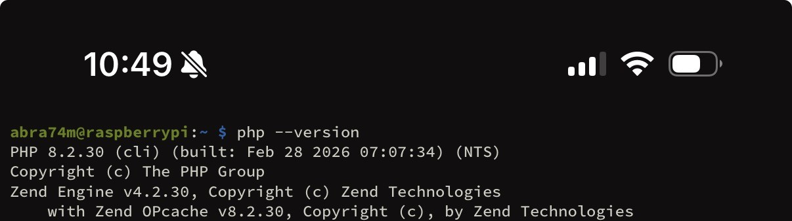
 

<h1>Claude API</h1>

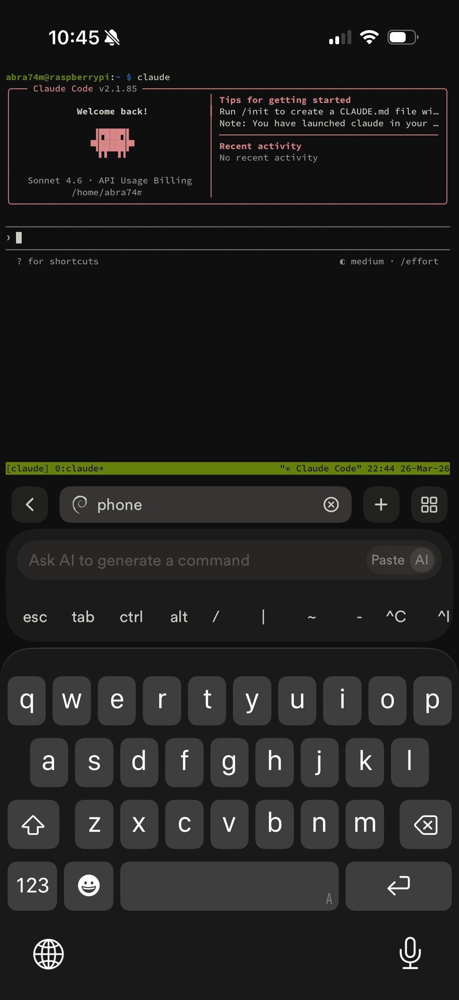

 I mean, how cool is it to create an entire website without writing a single piece of code from your iphone? Tmux pairs well with this so you can use Claude on any device and connect to the session

 

<h3>Wake on LAN Setup</h3>

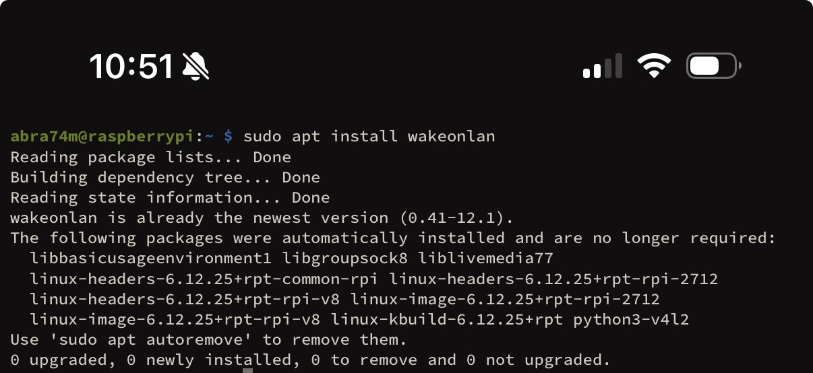

This is what is really cool. This allows for my Windows PC to be turned on via my Raspberry Pi. This is cool for when I want to use my iPhone to turn my computer on remotely. This is simply to ssh even if my PC is turned off. I wanted to have a true homelab setup here. 
  
<h2>Important Windows Settings (Magic Packet Recipient)</h2> 
 
<h1>Enter BIOS and Enable Power on by PCI-E</h1>

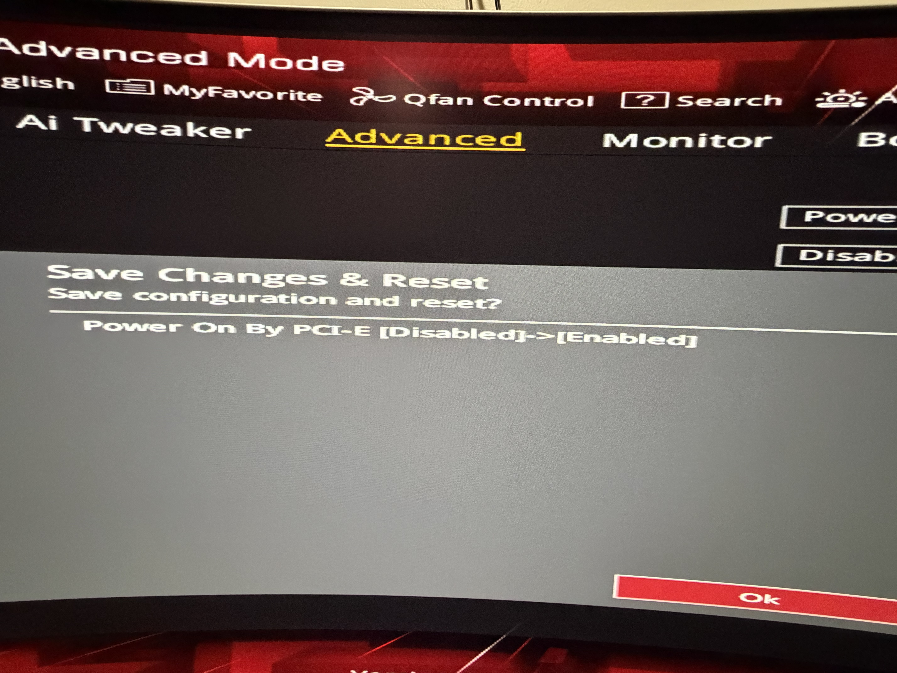

This allows for WoL "magic packets" to enable the device to turn on. I had Claude visualize the packet contents, but it is just 6 FF sent to a MAC address 16 times

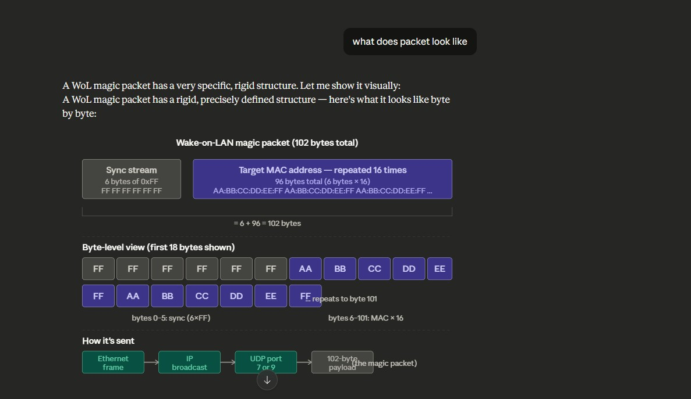

 
<h1>Turn off Fast Start</h1>

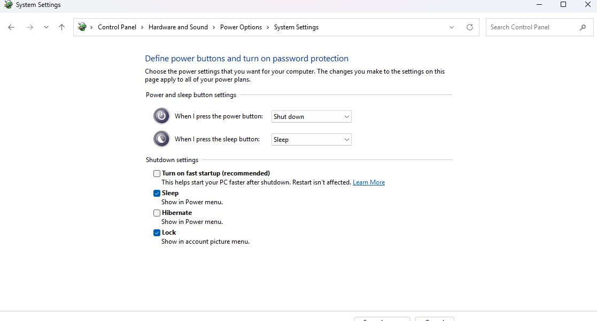
 
<h1>Device Manager Settings</h1>

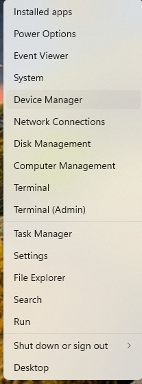
 
<h1>Enable Power-On by Magic Packet</h1>

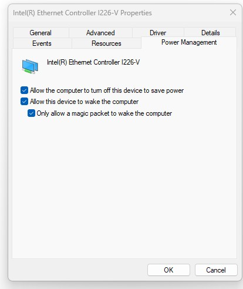
 
<h3>Turning on Windows PC Remotely</h3>

Since the command is just wakeonlan {MAC ADDRESS}, I just put it into a script to run that simple command quickly (and discretely)

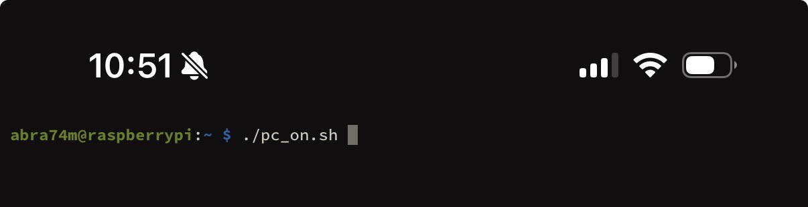
 
<h3>Connecting to Windows</h3>

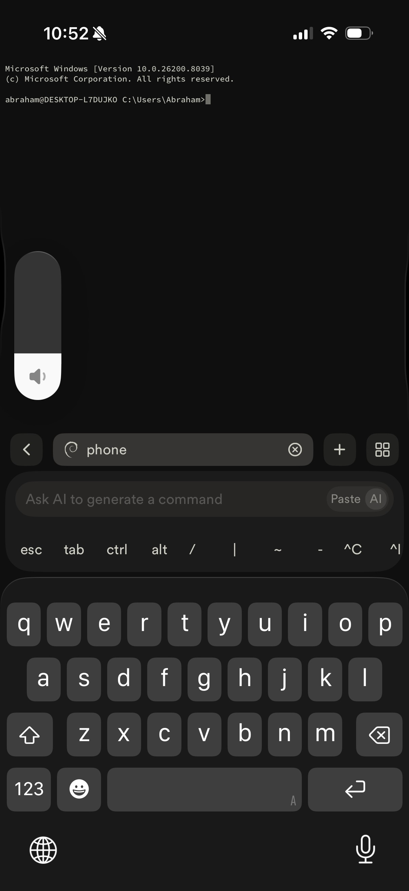

My homelab allows me to use my iPhone to turn on my Windows PC remotely, then ssh into that PC. This Raspberry Pi 5 setup is extremely versatile and fun to work wit. I appreciate anyone who read this far

